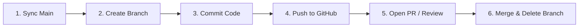

# GitHub Cloud & Remote Commands Guide

A comprehensive, DevOps-focused reference guide for managing remote repositories on GitHub, handling distributed collaboration workflows, CI/CD automation, SSH authentication, and GitHub CLI operations.

---

## 🌐 1. Remote Syncing

### `git clone`
- **Explanation:** Downloads an existing remote GitHub repository and its full version history to a new local directory.
- **Syntax:**
  ```bash
  git clone <repository-url> [<target-directory>]
  ```
- **Example:**
  ```bash
  # Clone a GitHub repo over HTTPS
  git clone https://github.com/organization/project-name.git

  # Clone via SSH into a custom folder
  git clone git@github.com:organization/project-name.git my-local-folder
  ```

### `git remote add`
- **Explanation:** Creates a named connection bookmark referencing a remote GitHub repository URL.
- **Syntax:**
  ```bash
  git remote add <remote-name> <remote-url>
  ```
- **Example:**
  ```bash
  # Add default origin remote
  git remote add origin https://github.com/username/my-repo.git

  # Add upstream remote for syncing an open-source fork
  git remote add upstream https://github.com/original-owner/original-repo.git
  ```

### `git remote -v`
- **Explanation:** Lists all configured remote tracking names alongside their read (fetch) and write (push) target URLs.
- **Syntax:**
  ```bash
  git remote -v
  ```
- **Example:**
  ```bash
  git remote -v
  # Output:
  # origin  https://github.com/username/repo.git (fetch)
  # origin  https://github.com/username/repo.git (push)
  ```

### `git fetch`
- **Explanation:** Downloads commits, files, and branch refs from the remote repository into local cache without modifying or merging your working tree.
- **Syntax:**
  ```bash
  git fetch [<remote-name>] [<branch-name>] [--all] [--prune]
  ```
- **Example:**
  ```bash
  # Fetch updates from origin and remove deleted remote tracking branches
  git fetch origin --prune
  ```

### `git pull`
- **Explanation:** Fetches remote changes from GitHub and immediately merges (or rebases) them into the current active local branch.
- **Syntax:**
  ```bash
  git pull [<remote-name>] [<branch-name>] [--rebase]
  ```
- **Example:**
  ```bash
  # Pull updates from origin main into active branch
  git pull origin main

  # Pull using rebase to maintain a clean linear commit history
  git pull --rebase origin main
  ```

### `git push`
- **Explanation:** Transmits local branch commits and references up to the remote repository on GitHub.
- **Syntax:**
  ```bash
  git push [-u <remote-name> <branch-name>] [--force-with-lease]
  ```
- **Example:**
  ```bash
  # Push a new local branch and link it for future tracking
  git push -u origin feature/user-profile

  # Standard push on already-tracked branch
  git push

  # Safe force-push after rebase (prevents overwriting teammate commits)
  git push --force-with-lease
  ```

---

## 🔑 2. SSH Key Setup & Authentication

Using SSH keys provides secure, passwordless authentication between your workstation and GitHub.

### Step 1: Generate an Ed25519 SSH Key Pair
```bash
ssh-keygen -t ed25519 -C "your.email@example.com"
```
*(Press Enter to accept default location `~/.ssh/id_ed25519` and optionally enter a secure passphrase).*

### Step 2: Start SSH Agent & Add Key
```bash
# Start the SSH agent in the background
eval "$(ssh-agent -s)"

# Add private key to agent
ssh-add ~/.ssh/id_ed25519
```

### Step 3: Copy Public Key & Add to GitHub
```bash
# Print public key to copy to clipboard
cat ~/.ssh/id_ed25519.pub
```
1. Open **GitHub** -> **Settings** -> **SSH and GPG keys**.
2. Click **New SSH key**, paste your key, and save.

### Step 4: Test SSH Connection
```bash
ssh -T git@github.com
# Expected output: Hi <username>! You've successfully authenticated...
```

---

## 🤝 3. Collaboration Workflows & Pull Requests (PR)

### Inspecting Remote Branches: `git branch -r`
- **Explanation:** Lists all remote-tracking branches cached locally from your configured remotes.
- **Syntax:**
  ```bash
  git branch -r [-a]
  ```
- **Example:**
  ```bash
  # View all remote branches
  git branch -r

  # Switch to and track a remote branch created by a colleague
  git switch --track origin/feature/dark-mode
  ```

### Standard GitHub Pull Request Workflow


1. **Update Local `main` Branch:**
   ```bash
   git switch main
   git pull origin main
   ```
2. **Create & Switch to Feature Branch:**
   ```bash
   git switch -c feature/order-receipts
   ```
3. **Make Commits:**
   ```bash
   git add .
   git commit -m "feat(receipts): generate automated PDF receipts"
   ```
4. **Push Feature Branch to GitHub:**
   ```bash
   git push -u origin feature/order-receipts
   ```
5. **Open Pull Request via GitHub CLI or Web UI:**
   ```bash
   gh pr create --title "feat(receipts): generate automated PDF receipts" --body "Implements PDF receipt generation."
   ```

---

## 🏷️ 4. Tags & Releases Distribution

### `git push --tags`
- **Explanation:** Pushes all local version tags up to the GitHub remote repository.
- **Syntax:**
  ```bash
  git push <remote-name> --tags
  git push <remote-name> <tag-name>
  ```
- **Example:**
  ```bash
  # Push a specific tag
  git push origin v1.0.0

  # Push all local tags in bulk
  git push origin --tags
  ```

### `gh release create`
- **Explanation:** Publishes a formal GitHub release bundled with release notes, changelogs, and binary assets.
- **Syntax:**
  ```bash
  gh release create <tag> [<files>...] [--title "<title>"] [--notes "<notes>"]
  ```
- **Example:**
  ```bash
  # Create release from an existing tag with auto-generated release notes
  gh release create v1.0.0 --title "v1.0.0 - Production Launch" --generate-notes

  # Attach binary build artifacts to release
  gh release create v1.0.0 ./dist/bundle.zip --title "v1.0.0" --notes "Production release assets"
  ```

---

## ⚡ 5. GitHub CLI (`gh`): Repositories, Issues & PRs

### Repository Management: `gh repo`
- **Authentication:**
  ```bash
  gh auth login
  ```
- **Create Repository:**
  ```bash
  # Create a remote repository and push current folder
  gh repo create my-project --public --source=. --remote=origin --push
  ```
- **Clone & Fork:**
  ```bash
  # Clone directly via GitHub CLI
  gh repo clone owner/repository-name

  # Fork a repository to your account and clone locally
  gh repo fork owner/repository-name --clone
  ```

### Issue Management: `gh issue`
- **Create Issue:**
  ```bash
  gh issue create --title "bug: payment webhook timeout" --body "Webhook fails after 30s." --label "bug"
  ```
- **List & View Issues:**
  ```bash
  # List open issues assigned to you
  gh issue list --assignee "@me"

  # View issue details and discussion
  gh issue view 42
  ```
- **Close Issue:**
  ```bash
  gh issue close 42 --comment "Fixed in commit d3e4f5a"
  ```

### Pull Request Operations: `gh pr`
- **Create PR:**
  ```bash
  gh pr create --title "feat: payment gateway" --body "Closes #42"
  ```
- **Check Out Teammate's PR:**
  ```bash
  gh pr checkout 105
  ```
- **Review & Merge PR:**
  ```bash
  # Approve PR
  gh pr review 105 --approve -b "LGTM!"

  # Merge PR using Squash & Merge and delete remote branch
  gh pr merge 105 --squash --delete-branch
  ```

---

## 🤖 6. CI/CD Automation: GitHub Actions via CLI (`gh workflow` / `gh run`)

Interact with GitHub Actions pipelines directly inside your terminal without opening a browser.

### Inspect & Trigger Workflows:
```bash
# List all GitHub Actions workflows in the repo
gh workflow list

# Manually trigger a workflow (workflow_dispatch)
gh workflow run deploy.yml -f environment=production

# View recent pipeline execution runs
gh run list
```

### Monitor & Debug CI Runs:
```bash
# Watch a live CI/CD workflow run until completion
gh run watch <run-id>

# View failure logs for a failed run
gh run view <run-id> --log-failed
```

---

## 🛡️ 7. GitHub Governance & Configuration Files

### `.github/CODEOWNERS`
Defines individuals or teams responsible for reviewing code modified in specific repository directories.
- **Location:** `.github/CODEOWNERS`
- **Example File Content:**
  ```text
  # Default owners for everything in repository
  * @core-dev-team

  # Backend services owned by backend team
  /src/backend/ @backend-team @lead-architect

  # Security configurations require security lead approval
  /.github/workflows/ @security-lead
  /security/ @security-lead
  ```

### Branch Protection Rules (Policy as Code)
Configured under **GitHub Settings -> Branches -> Branch protection rules**:
- **Require a pull request before merging:** Prevents direct pushes to `main`.
- **Require status checks to pass before merging:** Blocks merging unless CI tests pass.
- **Require signed commits:** Enforces GPG/SSH commit signature verification.
- **Do not allow bypassing the above settings:** Applies restrictions to repository admins.

### `.github/workflows/ci.yml` (GitHub Actions CI Definition)
- **Example continuous integration workflow configuration:**
  ```yaml
  name: Continuous Integration

  on:
    push:
      branches: [ main ]
    pull_request:
      branches: [ main ]

  jobs:
    build-and-test:
      runs-on: ubuntu-latest

      steps:
        - name: Check out repository
          uses: actions/checkout@v4

        - name: Setup Node.js environment
          uses: actions/setup-node@v4
          with:
            node-version: 20

        - name: Install dependencies
          run: npm ci

        - name: Run automated test suite
          run: npm test
  ```
