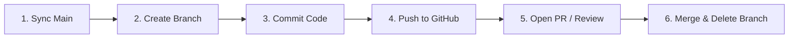

# GitHub Cloud & Remote Commands Guide

A comprehensive, DevOps-focused reference guide for managing remote repositories on GitHub, handling distributed collaboration workflows, and using the GitHub CLI.

---

## 🌐 1. Remote Syncing

### `git clone`
- **Explanation:** Downloads an existing remote GitHub repository and its full version history to a new local directory.
- **Syntax:**
  ```bash
  git clone <repository-url> [<target-directory>]
  ```
- **Example:**
  ```bash
  # Clone a GitHub repo over HTTPS
  git clone https://github.com/organization/project-name.git

  # Clone via SSH into a custom folder
  git clone git@github.com:organization/project-name.git my-local-folder
  ```

### `git remote add`
- **Explanation:** Creates a named connection bookmark referencing a remote GitHub repository URL.
- **Syntax:**
  ```bash
  git remote add <remote-name> <remote-url>
  ```
- **Example:**
  ```bash
  # Add default origin remote
  git remote add origin https://github.com/username/my-repo.git

  # Add upstream remote for syncing an open-source fork
  git remote add upstream https://github.com/original-owner/original-repo.git
  ```

### `git remote -v`
- **Explanation:** Lists all configured remote tracking names alongside their read (fetch) and write (push) target URLs.
- **Syntax:**
  ```bash
  git remote -v
  ```
- **Example:**
  ```bash
  git remote -v
  # Output:
  # origin  https://github.com/username/repo.git (fetch)
  # origin  https://github.com/username/repo.git (push)
  ```

### `git fetch`
- **Explanation:** Downloads commits, files, and branch refs from the remote repository into local cache without modifying or merging your working tree.
- **Syntax:**
  ```bash
  git fetch [<remote-name>] [<branch-name>] [--all] [--prune]
  ```
- **Example:**
  ```bash
  # Fetch updates from origin and remove deleted remote tracking branches
  git fetch origin --prune
  ```

### `git pull`
- **Explanation:** Fetches remote changes from GitHub and immediately merges (or rebases) them into the current active local branch.
- **Syntax:**
  ```bash
  git pull [<remote-name>] [<branch-name>] [--rebase]
  ```
- **Example:**
  ```bash
  # Pull updates from origin main into active branch
  git pull origin main

  # Pull using rebase to maintain a clean linear commit history
  git pull --rebase origin main
  ```

### `git push`
- **Explanation:** Transmits local branch commits and references up to the remote repository on GitHub.
- **Syntax:**
  ```bash
  git push [-u <remote-name> <branch-name>] [--force-with-lease]
  ```
- **Example:**
  ```bash
  # Push a new local branch and link it for future tracking
  git push -u origin feature/user-profile

  # Standard push on already-tracked branch
  git push

  # Safe force-push after rebase (prevents overwriting teammate commits)
  git push --force-with-lease
  ```

---

## 🤝 2. Collaboration Workflows & Pull Requests (PR)

### Inspecting Remote Branches: `git branch -r`
- **Explanation:** Lists all remote-tracking branches cached locally from your configured remotes.
- **Syntax:**
  ```bash
  git branch -r [-a]
  ```
- **Example:**
  ```bash
  # View all remote branches
  git branch -r

  # Switch to and track a remote branch created by a colleague
  git switch --track origin/feature/dark-mode
  ```

### Standard GitHub Pull Request Workflow (CLI & Git)
Follow this step-by-step cycle when collaborating across teams:



1. **Update Local `main` Branch:**
   ```bash
   git switch main
   git pull origin main
   ```
2. **Create & Switch to Feature Branch:**
   ```bash
   git switch -c feature/order-receipts
   ```
3. **Make Commits:**
   ```bash
   git add .
   git commit -m "feat(receipts): generate automated PDF receipts"
   ```
4. **Push Feature Branch to GitHub:**
   ```bash
   git push -u origin feature/order-receipts
   ```
5. **Open Pull Request:**
   - Navigate to your repository URL on GitHub or use GitHub CLI (`gh pr create`).
   - Request peer review, pass automated CI checks, and merge.

---

## ⚡ 3. Advanced Hosting Tools: GitHub CLI (`gh`)

While standard Git manages source history, the **GitHub CLI (`gh`)** brings GitHub-native features (Issues, Pull Requests, Releases, Repositories) directly into your command line.

### `gh auth login`
- **Explanation:** Authenticates your terminal session with your GitHub account credentials via browser or personal access token.
- **Syntax:**
  ```bash
  gh auth login
  ```
- **Example:**
  ```bash
  # Start interactive authentication workflow
  gh auth login
  ```

### `gh repo create`
- **Explanation:** Creates a new repository on GitHub directly from your terminal and connects it to your local workspace.
- **Syntax:**
  ```bash
  gh repo create [<name>] [--public|--private] [--source=<path>] [--push]
  ```
- **Example:**
  ```bash
  # Create a private GitHub repository from the current directory and push existing code
  gh repo create my-awesome-app --private --source=. --remote=origin --push
  ```

### `gh pr create` & `gh pr checkout`
- **Explanation:** Creates pull requests and checks out teammate PRs locally without opening a web browser.
- **Syntax:**
  ```bash
  gh pr create --title "<title>" --body "<body>"
  gh pr checkout <pr-number>
  ```
- **Example:**
  ```bash
  # Open a PR with title and summary
  gh pr create --title "feat: integrate Stripe API" --body "Resolves issue #42"

  # Check out PR #104 locally for testing and code review
  gh pr checkout 104
  ```
