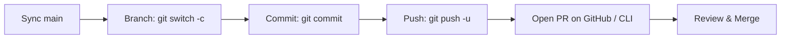

# GitHub Cloud Commands: Basic, Medium & Advanced

A structured, DevOps-aligned reference guide organized into progressive tiers—from basic remote repository syncing to intermediate collaboration workflows and advanced CI/CD automation.

---

## 🟢 TIER 1: BASIC (Remote Syncing & Tracking)

Fundamental commands for connecting a local project to GitHub, synchronizing changes, and pulling teammate updates.

### 1. Connecting & Cloning

#### `git clone`
- **Explanation:** Copies an entire remote repository, branches, and full history to a new local folder.
- **Syntax:** `git clone <repository-url> [<target-dir>]`
- **Example:**
  ```bash
  git clone https://github.com/organization/api-service.git
  ```

#### `git remote add`
- **Explanation:** Links a named remote nickname (`origin` or `upstream`) to a GitHub repository URL.
- **Syntax:** `git remote add <name> <url>`
- **Example:**
  ```bash
  git remote add origin https://github.com/username/my-project.git
  ```

#### `git remote -v`
- **Explanation:** Displays all configured remote bookmarks and their fetch/push URLs.
- **Syntax:** `git remote -v`
- **Example:**
  ```bash
  git remote -v
  ```

---

### 2. Pushing, Pulling & Fetching

#### `git fetch`
- **Explanation:** Downloads commits, new branches, and refs from GitHub into your local cache without altering your working code.
- **Syntax:** `git fetch [<remote>] [--prune]`
- **Example:**
  ```bash
  git fetch origin --prune
  ```

#### `git pull`
- **Explanation:** Fetches changes from GitHub and automatically merges (or rebases) them into your active branch.
- **Syntax:** `git pull [<remote>] [<branch>] [--rebase]`
- **Example:**
  ```bash
  # Standard pull
  git pull origin main

  # Pull with rebase for a clean linear history
  git pull --rebase origin main
  ```

#### `git push`
- **Explanation:** Uploads local commits and branch updates to the remote GitHub repository.
- **Syntax:** `git push [-u <remote> <branch>] [--force-with-lease]`
- **Example:**
  ```bash
  # First push: publish branch and set upstream tracking
  git push -u origin feature/auth

  # Subsequent pushes
  git push
  ```

#### `git branch -r`
- **Explanation:** Lists all remote-tracking branches cached locally from GitHub.
- **Syntax:** `git branch -r`
- **Example:**
  ```bash
  git branch -r
  ```

---

## 🟡 TIER 2: MEDIUM (Collaboration, SSH & CLI Tools)

Essential skills for multi-contributor teams, passwordless authentication, pull requests, and GitHub CLI essentials.

### 1. SSH Authentication Setup

#### `ssh-keygen` & Key Configuration
- **Explanation:** Generates a secure cryptographic key pair for passwordless authentication with GitHub.
- **Syntax & Setup Flow:**
  ```bash
  # 1. Generate Ed25519 key
  ssh-keygen -t ed25519 -C "your.email@example.com"

  # 2. Start SSH agent & add private key
  eval "$(ssh-agent -s)"
  ssh-add ~/.ssh/id_ed25519

  # 3. Print public key and paste into GitHub (Settings -> SSH Keys)
  cat ~/.ssh/id_ed25519.pub

  # 4. Verify connection
  ssh -T git@github.com
  ```

---

### 2. Pull Request (PR) Lifecycle

#### Standard End-to-End PR Workflow


```bash
# 1. Keep main updated
git switch main
git pull origin main

# 2. Branch out
git switch -c feature/payment-gateway

# 3. Stage & commit
git add .
git commit -m "feat(billing): integrate Stripe payment gateway"

# 4. Push to GitHub
git push -u origin feature/payment-gateway
```

---

### 3. Tag Distribution & Release Marks

#### `git push --tags`
- **Explanation:** Transmits all locally created release version tags up to GitHub.
- **Syntax:** `git push <remote> --tags`
- **Example:**
  ```bash
  git push origin --tags
  ```

---

### 4. GitHub CLI (`gh`) Essentials

#### `gh auth login`
- **Explanation:** Authenticates your terminal session directly with your GitHub account.
- **Syntax:** `gh auth login`

#### `gh repo create` & `gh repo fork`
- **Explanation:** Creates new repositories or forks existing upstream repositories straight from the command line.
- **Syntax:**
  ```bash
  gh repo create <name> [--public|--private] [--source=.] [--push]
  gh repo fork <owner/repo> [--clone]
  ```
- **Example:**
  ```bash
  # Initialize repo on GitHub and push local code
  gh repo create my-app --public --source=. --remote=origin --push

  # Fork open-source project and clone locally
  gh repo fork facebook/react --clone
  ```

---

## 🔴 TIER 3: ADVANCED (DevOps, CI/CD & Governance)

Enterprise-grade operations: PR automation, issue management, release artifact bundling, GitHub Actions orchestration, and repository governance.

### 1. Terminal-Based PR & Issue Management

#### `gh pr` (Create, Checkout, Review & Merge)
- **Explanation:** Conducts full Pull Request reviews, testing, and merging without opening a web browser.
- **Syntax & Examples:**
  ```bash
  # Create a PR with title and body
  gh pr create --title "feat(billing): Stripe integration" --body "Resolves #102"

  # Checkout a coworker's PR locally for testing
  gh pr checkout 102

  # Approve PR
  gh pr review 102 --approve -b "LGTM!"

  # Squash and merge PR, then delete remote branch
  gh pr merge 102 --squash --delete-branch
  ```

#### `gh issue` (Track & Resolve)
- **Explanation:** Interacts with GitHub Issues tracker directly from the CLI.
- **Syntax & Examples:**
  ```bash
  # Create issue
  gh issue create --title "bug: webhook 500 error" --body "Fails under heavy load" --label "bug"

  # List open issues assigned to you
  gh issue list --assignee "@me"

  # Close issue
  gh issue close 85 --comment "Resolved in PR #102"
  ```

---

### 2. GitHub Release Packaging (`gh release`)

#### `gh release create`
- **Explanation:** Publishes formal GitHub releases with attached compiled assets and auto-generated changelogs.
- **Syntax:** `gh release create <tag> [<files>...] [--generate-notes]`
- **Example:**
  ```bash
  # Create release v1.0.0 and upload distribution binary
  gh release create v1.0.0 ./dist/app.zip --title "v1.0.0 Launch" --generate-notes
  ```

---

### 3. CI/CD Orchestration (GitHub Actions via CLI)

#### `gh workflow` & `gh run`
- **Explanation:** Triggers, inspects, and troubleshoots GitHub Actions continuous integration workflows from your terminal.
- **Syntax & Examples:**
  ```bash
  # List all workflow files
  gh workflow list

  # Manually run a deployment workflow
  gh workflow run deploy.yml -f environment=production

  # View recent runs
  gh run list

  # Watch live workflow logs in terminal
  gh run watch <run-id>

  # View logs for failed jobs
  gh run view <run-id> --log-failed
  ```

---

### 4. Repository Governance & Configuration Files

#### `.github/CODEOWNERS`
- **Explanation:** Automatically assigns mandatory reviewers when files in specified directories are modified in PRs.
- **Example Content:**
  ```text
  # Global repository owners
  * @tech-lead

  # Backend services
  /src/backend/ @backend-team

  # Security & CI/CD workflows
  /.github/workflows/ @devops-team @security-lead
  ```

#### Branch Protection Rules
- **Explanation:** Enforces repository security policies before code reaches production branches (`main`/`release`).
- **Core Rules:**
  - *Require a pull request before merging* (blocks direct pushes).
  - *Require status checks to pass* (CI test suite must be green).
  - *Require signed commits* (enforces cryptographic verification).
  - *Enforce for Administrators* (prevents admin override).

#### `.github/workflows/ci.yml` (CI Workflow Configuration)
- **Example:**
  ```yaml
  name: CI Pipeline

  on:
    push:
      branches: [ main ]
    pull_request:
      branches: [ main ]

  jobs:
    build-and-test:
      runs-on: ubuntu-latest
      steps:
        - uses: actions/checkout@v4
        - uses: actions/setup-node@v4
          with:
            node-version: 20
        - run: npm ci
        - run: npm test
  ```
